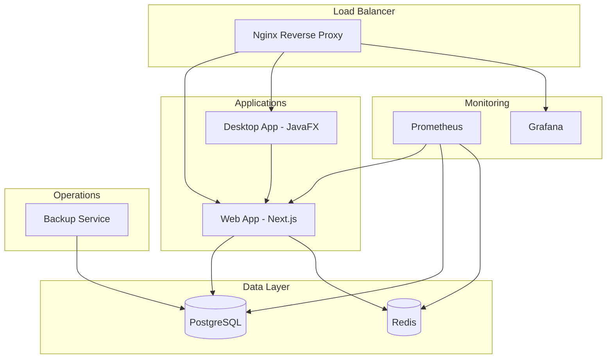

# Documentation Docker EcoDeli

## 🏗️ Architecture Docker

EcoDeli utilise une architecture microservices containerisée avec Docker Compose pour orchestrer tous les services.



## 📁 Structure des Conteneurs

### Vue d'ensemble

| Service | Image | Port | Description |
|---------|-------|------|-------------|
| nginx | nginx:alpine + custom | 80, 443 | Reverse proxy, SSL termination |
| web | node:20-alpine + app | 3000 | Application Next.js |
| desktop | openjdk:17-jre-alpine + app | 8080 | Application JavaFX |
| postgres | postgres:16-alpine + config | 5432 | Base de données principale |
| redis | redis:7-alpine | 6379 | Cache et sessions |
| prometheus | prom/prometheus | 9090 | Collecte de métriques |
| grafana | grafana/grafana | 3000 | Dashboards et alertes |
| backup | alpine + scripts | - | Service de backup automatisé |

## 🐳 Configuration des Services

### Nginx (Reverse Proxy)

```dockerfile
FROM nginx:1.25-alpine

# Installation des outils SSL
RUN apk add --no-cache openssl curl

# Configuration multi-environnement
COPY nginx.conf /etc/nginx/nginx.conf
COPY conf.d/ /etc/nginx/conf.d/
COPY ssl/ /etc/nginx/ssl/

# Script SSL auto-généré
COPY scripts/generate-ssl.sh /usr/local/bin/
RUN chmod +x /usr/local/bin/generate-ssl.sh

# Health check intégré
HEALTHCHECK --interval=30s --timeout=5s \
    CMD curl -f http://localhost/health || exit 1
```

**Fonctionnalités:**
- SSL/TLS avec génération automatique de certificats
- Load balancing avec health checks
- Rate limiting configurable
- Compression gzip
- Cache statique
- Logs structurés JSON

### Application Web (Next.js)

```dockerfile
# Multi-stage build optimisé
FROM node:20-alpine AS deps
WORKDIR /app
RUN npm install -g pnpm
COPY package.json pnpm-lock.yaml ./
RUN pnpm install --frozen-lockfile

FROM node:20-alpine AS builder
WORKDIR /app
COPY --from=deps /app/node_modules ./node_modules
COPY . .
RUN pnpm build

FROM node:20-alpine AS production
# Configuration sécurisée non-root
RUN addgroup -g 1001 -S nodejs
RUN adduser -S nextjs -u 1001
COPY --from=builder --chown=nextjs:nodejs /app/.next/standalone ./
USER nextjs
EXPOSE 3000
CMD ["node", "server.js"]
```

**Fonctionnalités:**
- Build multi-stage pour optimisation
- Image minimale en production
- Utilisateur non-root pour sécurité
- Health checks intégrés
- Variables d'environnement sécurisées

### Application Desktop (JavaFX)

```dockerfile
FROM openjdk:17-jdk-alpine AS builder
WORKDIR /app
COPY pom.xml ./
COPY src/ ./src/
RUN mvn clean package -DskipTests

FROM openjdk:17-jre-alpine AS runtime
# Support GUI avec Xvfb
RUN apk add --no-cache xvfb x11vnc fluxbox
# Configuration utilisateur non-root
RUN adduser -u 1001 -S ecodeli
COPY --from=builder /app/target/ecodeli-desktop.jar ./
USER ecodeli
EXPOSE 8080
CMD ["java", "-jar", "ecodeli-desktop.jar"]
```

**Modes d'exécution:**
- **GUI Mode**: Interface graphique avec Xvfb
- **Headless Mode**: API seulement pour génération de rapports
- **Development Mode**: Debug activé sur port 5005

### PostgreSQL

```dockerfile
FROM postgres:16-alpine

# Installation extensions
RUN apk add --no-cache postgresql-contrib

# Configuration optimisée
COPY postgresql.conf /etc/postgresql/
COPY pg_hba.conf /etc/postgresql/

# Scripts d'initialisation
COPY init-scripts/ /docker-entrypoint-initdb.d/

# Backup scripts
COPY backup-scripts/ /usr/local/bin/backup/
RUN chmod +x /usr/local/bin/backup/*.sh

HEALTHCHECK --interval=30s --timeout=5s \
    CMD pg_isready -U postgres || exit 1
```

**Configuration:**
- Paramètres optimisés pour performance
- Extensions: uuid-ossp, pgcrypto, pg_stat_statements
- Utilisateurs spécialisés (app, monitoring, backup)
- Logs structurés
- SSL activé

### Redis

```dockerfile
FROM redis:7-alpine

# Configuration personnalisée
COPY redis.conf /usr/local/etc/redis/redis.conf

# Scripts de monitoring
COPY redis-monitor.sh /usr/local/bin/
RUN chmod +x /usr/local/bin/redis-monitor.sh

HEALTHCHECK --interval=30s --timeout=3s \
    CMD redis-cli ping || exit 1

CMD ["redis-server", "/usr/local/etc/redis/redis.conf"]
```

**Configuration:**
- Persistence RDB + AOF
- Maxmemory policy: allkeys-lru
- Monitoring activé
- Connexions sécurisées

## 🔧 Docker Compose

### Structure des Fichiers

```
docker-compose.yml              # Configuration de base
docker-compose.dev.yml          # Overrides développement
docker-compose.prod.yml         # Overrides production
docker-compose.staging.yml      # Overrides staging
```

### Configuration de Base

```yaml
version: '3.8'

services:
  nginx:
    build:
      context: ./docker/nginx
      dockerfile: Dockerfile
    container_name: ecodeli-nginx
    ports:
      - "80:80"
      - "443:443"
    volumes:
      - uploads:/var/www/uploads
      - nginx-logs:/var/log/nginx
    networks:
      - ecodeli-network
    depends_on:
      - web
      - desktop
    restart: unless-stopped

  web:
    build:
      context: ./apps/web
      dockerfile: Dockerfile
      target: production
    container_name: ecodeli-web
    environment:
      - NODE_ENV=production
      - DATABASE_URL=${DATABASE_URL}
      - REDIS_URL=${REDIS_URL}
    volumes:
      - uploads:/app/uploads
    networks:
      - ecodeli-network
    depends_on:
      - postgres
      - redis
    restart: unless-stopped

networks:
  ecodeli-network:
    driver: bridge
    ipam:
      config:
        - subnet: 172.20.0.0/16

volumes:
  postgres-data:
  redis-data:
  uploads:
  nginx-logs:
  grafana-data:
  prometheus-data:
```

### Environnement Développement

```yaml
# docker-compose.dev.yml
version: '3.8'

services:
  web:
    build:
      target: development
    command: ["npm", "run", "dev"]
    volumes:
      - ./apps/web:/app
      - /app/node_modules
    environment:
      - NODE_ENV=development
      - WATCHPACK_POLLING=true
    ports:
      - "3000:3000"
      - "9229:9229"  # Debug port

  desktop:
    build:
      target: development
    environment:
      - JAVA_OPTS=-agentlib:jdwp=transport=dt_socket,server=y,suspend=n,address=*:5005
    ports:
      - "8080:8080"
      - "5005:5005"  # Debug port

  # Services additionnels développement
  adminer:
    image: adminer:4.8.1
    ports:
      - "8081:8080"
    networks:
      - ecodeli-network

  redis-commander:
    image: rediscommander/redis-commander:latest
    environment:
      - REDIS_HOSTS=local:redis:6379
    ports:
      - "8082:8081"
    networks:
      - ecodeli-network
```

### Environnement Production

```yaml
# docker-compose.prod.yml
version: '3.8'

services:
  web:
    deploy:
      replicas: 2
      resources:
        limits:
          cpus: '2.0'
          memory: 2G
        reservations:
          cpus: '1.0'
          memory: 1G
      restart_policy:
        condition: on-failure
        delay: 5s
        max_attempts: 3
    logging:
      driver: "json-file"
      options:
        max-size: "10m"
        max-file: "3"

  postgres:
    volumes:
      - /opt/ecodeli/data/postgres:/var/lib/postgresql/data
      - /opt/ecodeli/backups:/var/lib/postgresql/backups
    deploy:
      resources:
        limits:
          cpus: '2.0'
          memory: 4G

  nginx:
    volumes:
      - /opt/ecodeli/ssl:/etc/nginx/ssl:ro
      - /opt/ecodeli/logs/nginx:/var/log/nginx
```

## 🚀 Commandes Docker Utiles

### Gestion des Services

```bash
# Démarrage complet
docker-compose up -d

# Démarrage avec rebuild
docker-compose up -d --build

# Arrêt propre
docker-compose down

# Arrêt avec suppression volumes
docker-compose down -v

# Redémarrage d'un service
docker-compose restart web

# Logs en temps réel
docker-compose logs -f web

# Status des services
docker-compose ps

# Exec dans un conteneur
docker-compose exec web bash
```

### Build et Images

```bash
# Build toutes les images
docker-compose build

# Build avec cache désactivé
docker-compose build --no-cache

# Build image spécifique
docker-compose build web

# Pull des images externes
docker-compose pull

# Liste des images
docker images

# Nettoyage images inutilisées
docker image prune -f
```

### Volumes et Données

```bash
# Liste des volumes
docker volume ls

# Inspection d'un volume
docker volume inspect ecodeli_postgres-data

# Backup d'un volume
docker run --rm -v ecodeli_postgres-data:/data -v $(pwd):/backup alpine tar czf /backup/postgres-backup.tar.gz -C /data .

# Restauration d'un volume
docker run --rm -v ecodeli_postgres-data:/data -v $(pwd):/backup alpine tar xzf /backup/postgres-backup.tar.gz -C /data
```

### Monitoring et Debug

```bash
# Utilisation ressources
docker stats

# Événements en temps réel
docker events

# Inspection d'un conteneur
docker inspect ecodeli-web

# Processus dans un conteneur
docker-compose top web

# Health check status
docker inspect --format='{{.State.Health.Status}}' ecodeli-web
```

## 🔍 Debugging

### Logs Avancés

```bash
# Logs avec timestamp
docker-compose logs --timestamps web

# Logs depuis une date
docker-compose logs --since="2024-01-01T00:00:00Z" web

# Logs par niveau (si configuré)
docker-compose logs web 2>&1 | grep -i error

# Export logs
docker-compose logs --no-color > debug-logs.txt
```

### Debug d'un Service

```bash
# Entrer dans le conteneur
docker-compose exec web bash

# Vérifier les variables d'environnement
docker-compose exec web printenv

# Tester la connectivité réseau
docker-compose exec web ping postgres

# Vérifier les ports
docker-compose exec web netstat -tulpn
```

### Performance

```bash
# Stats détaillées
docker stats --format "table {{.Container}}\t{{.CPUPerc}}\t{{.MemUsage}}\t{{.MemPerc}}\t{{.NetIO}}\t{{.BlockIO}}"

# Utilisation disque
docker system df

# Analyse d'une image
docker history ecodeli-web
```

## 🛡️ Sécurité Docker

### Bonnes Pratiques

1. **Utilisateurs non-root**
```dockerfile
# Créer utilisateur dédié
RUN addgroup -g 1001 -S appgroup
RUN adduser -u 1001 -S appuser -G appgroup
USER appuser
```

2. **Images minimales**
```dockerfile
# Utiliser des images alpine
FROM node:20-alpine
# ou distroless pour production
FROM gcr.io/distroless/nodejs:20
```

3. **Secrets management**
```yaml
# Utiliser Docker secrets
secrets:
  db_password:
    file: ./secrets/db_password.txt

services:
  web:
    secrets:
      - db_password
```

4. **Réseau isolé**
```yaml
networks:
  frontend:
    driver: bridge
  backend:
    driver: bridge
    internal: true
```

### Scanning de Sécurité

```bash
# Scan avec Docker Scout
docker scout cves ecodeli-web

# Scan avec Trivy
trivy image ecodeli-web

# Audit des configurations
docker-bench-security
```

## 📊 Monitoring Docker

### Métriques Exportées

- CPU, mémoire, réseau, I/O disque par conteneur
- Logs structurés avec labels
- Health checks automatiques
- Alertes sur restart/failure

### Configuration Prometheus

```yaml
# prometheus.yml
scrape_configs:
  - job_name: 'docker'
    static_configs:
      - targets: ['cadvisor:8080']
    
  - job_name: 'ecodeli-web'
    static_configs:
      - targets: ['web:3000']
    metrics_path: '/api/metrics'
```

### Dashboards Grafana

- Docker Host Overview
- Container Metrics
- Application Specific Metrics
- Log Aggregation

---

*Documentation mise à jour le: $(date)*
*Version: 1.0.0*