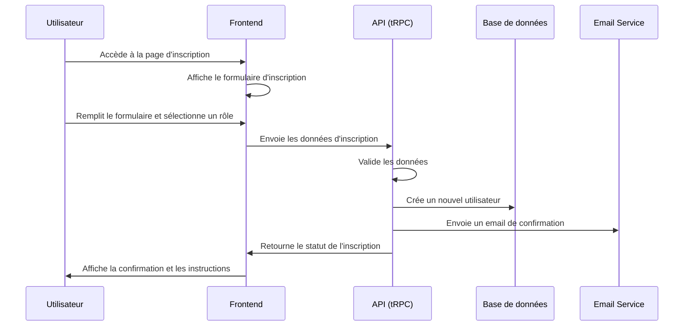
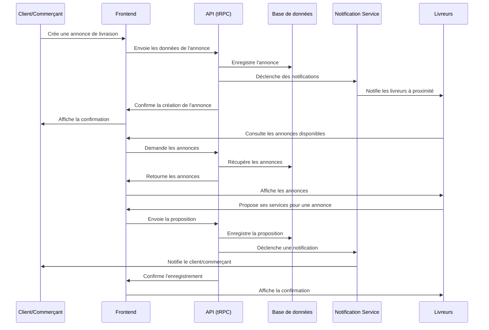
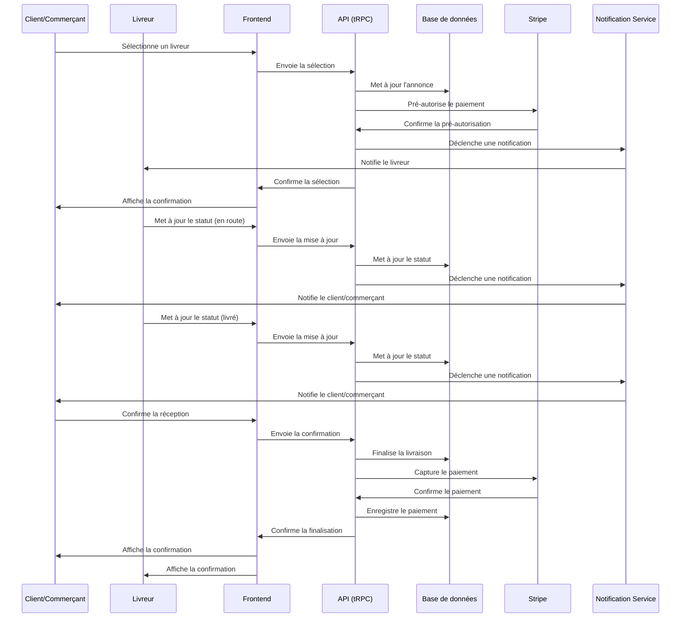
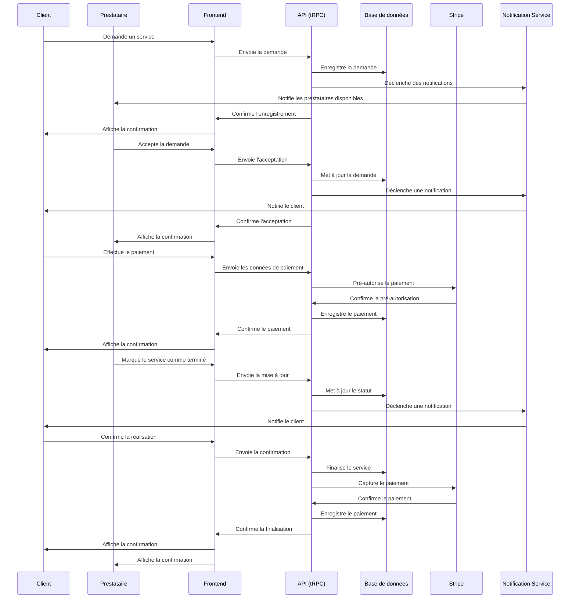
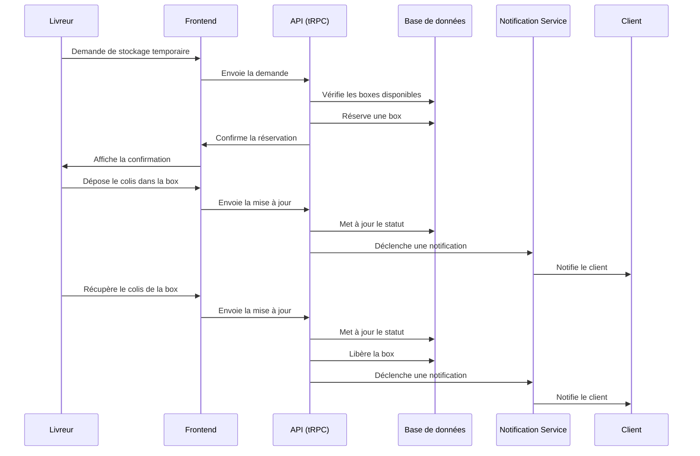
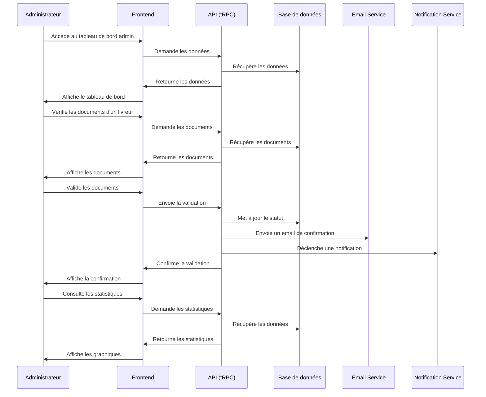

# Workflow et Communications du Projet EcoDeli

## Vue d'ensemble

Ce document détaille les flux de travail et les communications entre les différentes parties du système EcoDeli, une plateforme de crowdshipping qui met en relation des particuliers et des entreprises pour la livraison de colis et des services à la personne.

## Architecture Globale

L'architecture du projet EcoDeli est basée sur une approche moderne utilisant Next.js avec App Router, tRPC pour les API typées, et Prisma pour l'ORM. Voici comment les différentes parties du système communiquent entre elles :

```
┌─────────────────┐     ┌─────────────────┐     ┌─────────────────┐
│                 │     │                 │     │                 │
│    Frontend     │◄────┤     tRPC        │◄────┤    Backend      │
│    (Next.js)    │     │    (API)        │     │   (Serveur)     │
│                 │────►│                 │────►│                 │
└─────────────────┘     └─────────────────┘     └────────┬────────┘
                                                         │
                                                         ▼
                                                ┌─────────────────┐
                                                │                 │
                                                │     Prisma      │
                                                │     (ORM)       │
                                                │                 │
                                                └────────┬────────┘
                                                         │
                                                         ▼
                                                ┌─────────────────┐
                                                │                 │
                                                │   PostgreSQL    │
                                                │  (Base de       │
                                                │   données)      │
                                                │                 │
                                                └─────────────────┘
```

## Services Externes Intégrés

EcoDeli intègre plusieurs services externes pour assurer ses fonctionnalités :

1. **Stripe** : Gestion des paiements sécurisés
2. **OneSignal** : Notifications push
3. **Cloudinary** : Stockage et gestion des images
4. **Google Maps API** : Géolocalisation et calcul d'itinéraires
5. **React Email** : Templates d'emails
6. **NextAuth.js** : Authentification

## Flux de Travail Détaillés

### 1. Inscription et Authentification



#### Détails du processus d'inscription :

1. L'utilisateur accède à la page d'inscription et remplit le formulaire
2. Selon le rôle sélectionné (client, livreur, commerçant, prestataire), des champs spécifiques sont affichés
3. Pour les livreurs et prestataires :
   - Demande de documents justificatifs (pièce d'identité, permis de conduire, etc.)
   - Statut "en attente de vérification" jusqu'à validation par un administrateur
4. Pour les commerçants :
   - Demande d'informations sur l'entreprise (SIRET, adresse, etc.)
   - Création d'un contrat qui sera validé par un administrateur
5. Un email de confirmation est envoyé à l'utilisateur
6. L'utilisateur confirme son email et peut se connecter

### 2. Gestion des Annonces



#### Détails du processus de gestion des annonces :

1. Le client ou commerçant crée une annonce en spécifiant :
   - Type de livraison (colis, courses, etc.)
   - Adresse de départ et d'arrivée
   - Date et heure souhaitées
   - Poids et dimensions (pour les colis)
   - Description et instructions
   - Prix proposé
2. L'annonce est enregistrée dans la base de données
3. Les livreurs à proximité sont notifiés via OneSignal
4. Les livreurs peuvent consulter les annonces et proposer leurs services
5. Le client/commerçant reçoit les propositions et sélectionne un livreur
6. Le livreur est notifié de l'acceptation

### 3. Processus de Livraison



#### Détails du processus de livraison :

1. Une fois le livreur sélectionné, le client/commerçant effectue un pré-paiement via Stripe
2. Le livreur est notifié et peut accepter la mission
3. Le livreur met à jour le statut de la livraison à chaque étape :
   - En route pour récupérer le colis
   - Colis récupéré
   - En cours de livraison
   - Livré
4. Le client/commerçant est notifié à chaque changement de statut
5. Le client confirme la réception du colis
6. Le paiement est capturé et transféré au livreur (moins la commission d'EcoDeli)
7. Une facture est générée automatiquement

### 4. Services à la Personne



#### Détails du processus de service à la personne :

1. Le client demande un service en spécifiant :
   - Type de service (transport, garde d'animaux, etc.)
   - Date et heure souhaitées
   - Adresse
   - Description et instructions
2. Les prestataires disponibles sont notifiés
3. Un prestataire accepte la demande
4. Le client effectue un pré-paiement via Stripe
5. Le prestataire effectue le service et met à jour le statut
6. Le client confirme la réalisation du service
7. Le paiement est capturé et transféré au prestataire (moins la commission d'EcoDeli)
8. Une facture est générée automatiquement

### 5. Gestion des Entrepôts et Boxes



#### Détails du processus de gestion des entrepôts :

1. Le livreur peut demander un stockage temporaire dans un entrepôt EcoDeli
2. Le système vérifie les boxes disponibles dans l'entrepôt le plus proche
3. Une box est réservée pour le livreur
4. Le livreur dépose le colis dans la box et met à jour le statut
5. Le client est notifié du stockage temporaire
6. Lorsque le livreur récupère le colis, il met à jour le statut
7. La box est libérée et disponible pour d'autres utilisations

### 6. Administration et Gestion



#### Détails du processus d'administration :

1. Les administrateurs ont accès à un tableau de bord complet
2. Ils peuvent :
   - Valider les documents des livreurs et prestataires
   - Gérer les contrats des commerçants
   - Suivre les livraisons et services en cours
   - Gérer les paiements et factures
   - Consulter les statistiques et rapports
   - Gérer les entrepôts et boxes
   - Configurer les paramètres du système
3. Les actions des administrateurs sont enregistrées dans des logs
4. Des notifications sont envoyées aux utilisateurs concernés

## Communication entre les Modules

### 1. Communication Frontend-Backend

La communication entre le frontend et le backend est assurée par tRPC, qui offre une API typée et sécurisée. Voici les principaux avantages :

- **Typage complet** : Les types sont partagés entre le frontend et le backend
- **Autocomplétion** : IntelliSense dans l'IDE pour les appels API
- **Validation automatique** : Avec Zod pour garantir l'intégrité des données
- **Gestion des erreurs** : Propagation des erreurs du backend au frontend

Exemple de définition d'un routeur tRPC :

```typescript
// src/server/api/routers/delivery.ts
export const deliveryRouter = createTRPCRouter({
  getAll: protectedProcedure
    .input(z.object({
      status: z.enum(['PENDING', 'ACCEPTED', 'PICKED_UP', 'IN_TRANSIT', 'DELIVERED', 'CANCELLED']).optional(),
      limit: z.number().min(1).max(100).default(10),
      cursor: z.string().nullish(),
    }))
    .query(async ({ ctx, input }) => {
      const { status, limit, cursor } = input;
      const userId = ctx.session.user.id;
      
      const items = await ctx.prisma.delivery.findMany({
        where: {
          OR: [
            { clientId: userId },
            { delivererId: userId },
          ],
          ...(status ? { status } : {}),
        },
        take: limit + 1,
        cursor: cursor ? { id: cursor } : undefined,
        orderBy: { createdAt: 'desc' },
        include: {
          client: {
            include: {
              user: {
                select: {
                  id: true,
                  name: true,
                  email: true,
                },
              },
            },
          },
          deliverer: {
            include: {
              user: {
                select: {
                  id: true,
                  name: true,
                  email: true,
                },
              },
            },
          },
        },
      });
      
      let nextCursor: typeof cursor | undefined = undefined;
      if (items.length > limit) {
        const nextItem = items.pop();
        nextCursor = nextItem?.id;
      }
      
      return {
        items,
        nextCursor,
      };
    }),
  
  create: protectedProcedure
    .input(z.object({
      pickupAddress: z.string(),
      deliveryAddress: z.string(),
      pickupDate: z.date(),
      weight: z.number().optional(),
      dimensions: z.string().optional(),
      description: z.string().optional(),
      price: z.number(),
      type: z.enum(['PACKAGE', 'SHOPPING_CART', 'AIRPORT_TRANSFER', 'GROCERY', 'FOREIGN_PRODUCT']),
    }))
    .mutation(async ({ ctx, input }) => {
      const userId = ctx.session.user.id;
      const client = await ctx.prisma.client.findUnique({
        where: { userId },
      });
      
      if (!client) {
        throw new TRPCError({
          code: 'BAD_REQUEST',
          message: 'You must be a client to create a delivery',
        });
      }
      
      const delivery = await ctx.prisma.delivery.create({
        data: {
          status: 'PENDING',
          clientId: client.id,
          ...input,
        },
      });
      
      return delivery;
    }),
  
  // Autres procédures...
});
```

### 2. Communication Backend-Base de données

La communication entre le backend et la base de données est assurée par Prisma ORM, qui offre :

- **Typage complet** : Les modèles Prisma génèrent des types TypeScript
- **Migrations automatiques** : Gestion des changements de schéma
- **Requêtes optimisées** : Prisma génère des requêtes SQL optimisées
- **Relations** : Gestion facile des relations entre les modèles

Exemple d'utilisation de Prisma dans un service :

```typescript
// src/server/services/payment.service.ts
export const PaymentService = {
  async createPayment(data: {
    amount: number;
    clientId: string;
    deliveryId?: string;
    serviceId?: string;
  }) {
    const { amount, clientId, deliveryId, serviceId } = data;
    
    // Créer un paiement dans Stripe
    const stripePayment = await stripe.paymentIntents.create({
      amount: Math.round(amount * 100), // Stripe utilise les centimes
      currency: 'eur',
      metadata: {
        clientId,
        deliveryId: deliveryId || '',
        serviceId: serviceId || '',
      },
    });
    
    // Enregistrer le paiement dans la base de données
    const payment = await prisma.payment.create({
      data: {
        amount,
        status: 'PENDING',
        stripePaymentId: stripePayment.id,
        client: { connect: { id: clientId } },
        ...(deliveryId ? { delivery: { connect: { id: deliveryId } } } : {}),
        ...(serviceId ? { service: { connect: { id: serviceId } } } : {}),
      },
    });
    
    return {
      payment,
      clientSecret: stripePayment.client_secret,
    };
  },
  
  async capturePayment(paymentId: string) {
    const payment = await prisma.payment.findUnique({
      where: { id: paymentId },
    });
    
    if (!payment) {
      throw new Error('Payment not found');
    }
    
    if (payment.status !== 'PENDING') {
      throw new Error('Payment cannot be captured');
    }
    
    // Capturer le paiement dans Stripe
    await stripe.paymentIntents.capture(payment.stripePaymentId!);
    
    // Mettre à jour le statut du paiement
    const updatedPayment = await prisma.payment.update({
      where: { id: paymentId },
      data: { status: 'COMPLETED' },
    });
    
    return updatedPayment;
  },
  
  // Autres méthodes...
};
```

### 3. Gestion des Notifications

Les notifications sont gérées par OneSignal pour les notifications push et par React Email pour les emails :

```typescript
// src/server/services/notification.service.ts
export const NotificationService = {
  async sendPushNotification(data: {
    userId: string;
    title: string;
    message: string;
    data?: Record<string, string>;
  }) {
    const { userId, title, message, data } = data;
    
    // Récupérer les tokens de l'utilisateur
    const user = await prisma.user.findUnique({
      where: { id: userId },
      select: { pushTokens: true },
    });
    
    if (!user?.pushTokens?.length) {
      return;
    }
    
    // Envoyer la notification via OneSignal
    await oneSignal.createNotification({
      include_player_ids: user.pushTokens,
      headings: { en: title, fr: title },
      contents: { en: message, fr: message },
      data,
    });
  },
  
  async sendEmail(data: {
    to: string;
    subject: string;
    template: 'WELCOME' | 'DELIVERY_CONFIRMATION' | 'PAYMENT_RECEIPT';
    props: Record<string, any>;
  }) {
    const { to, subject, template, props } = data;
    
    // Sélectionner le template d'email
    let emailTemplate;
    switch (template) {
      case 'WELCOME':
        emailTemplate = WelcomeEmail;
        break;
      case 'DELIVERY_CONFIRMATION':
        emailTemplate = DeliveryConfirmationEmail;
        break;
      case 'PAYMENT_RECEIPT':
        emailTemplate = PaymentReceiptEmail;
        break;
    }
    
    // Générer le HTML de l'email
    const html = render(React.createElement(emailTemplate, props));
    
    // Envoyer l'email
    await nodemailer.sendMail({
      from: 'contact@ecodeli.fr',
      to,
      subject,
      html,
    });
  },
};
```

### 4. Gestion des Paiements

Les paiements sont gérés par Stripe :

```typescript
// src/server/services/stripe.service.ts
export const StripeService = {
  async createPaymentIntent(data: {
    amount: number;
    currency: string;
    metadata: Record<string, string>;
  }) {
    const { amount, currency, metadata } = data;
    
    const paymentIntent = await stripe.paymentIntents.create({
      amount: Math.round(amount * 100), // Stripe utilise les centimes
      currency,
      metadata,
      automatic_payment_methods: { enabled: true },
    });
    
    return paymentIntent;
  },
  
  async createConnectedAccount(data: {
    email: string;
    country: string;
    type: 'individual' | 'company';
  }) {
    const { email, country, type } = data;
    
    const account = await stripe.accounts.create({
      type: 'express',
      email,
      country,
      business_type: type,
      capabilities: {
        card_payments: { requested: true },
        transfers: { requested: true },
      },
    });
    
    return account;
  },
  
  async createAccountLink(accountId: string, refreshUrl: string, returnUrl: string) {
    const accountLink = await stripe.accountLinks.create({
      account: accountId,
      refresh_url: refreshUrl,
      return_url: returnUrl,
      type: 'account_onboarding',
    });
    
    return accountLink;
  },
  
  // Autres méthodes...
};
```

## Internationalisation

L'internationalisation est gérée par next-intl :

```typescript
// src/messages/fr.json
{
  "common": {
    "welcome": "Bienvenue sur EcoDeli",
    "login": "Connexion",
    "register": "Inscription",
    "logout": "Déconnexion"
  },
  "delivery": {
    "create": "Créer une livraison",
    "status": {
      "PENDING": "En attente",
      "ACCEPTED": "Acceptée",
      "PICKED_UP": "Récupérée",
      "IN_TRANSIT": "En transit",
      "DELIVERED": "Livrée",
      "CANCELLED": "Annulée"
    }
  }
}

// src/messages/en.json
{
  "common": {
    "welcome": "Welcome to EcoDeli",
    "login": "Login",
    "register": "Register",
    "logout": "Logout"
  },
  "delivery": {
    "create": "Create a delivery",
    "status": {
      "PENDING": "Pending",
      "ACCEPTED": "Accepted",
      "PICKED_UP": "Picked up",
      "IN_TRANSIT": "In transit",
      "DELIVERED": "Delivered",
      "CANCELLED": "Cancelled"
    }
  }
}
```

## Sécurité

La sécurité est assurée par plusieurs mécanismes :

1. **Authentification** : NextAuth.js avec l'adaptateur Prisma
2. **Autorisation** : Middleware tRPC pour vérifier les permissions
3. **Validation des données** : Zod pour valider les entrées
4. **Protection CSRF** : next-csrf pour protéger contre les attaques CSRF
5. **Rate limiting** : rate-limiter-flexible pour limiter les requêtes
6. **Helmet** : Pour configurer les en-têtes HTTP de sécurité

Exemple de middleware d'autorisation :

```typescript
// src/server/api/trpc.ts
const isAdmin = t.middleware(async ({ ctx, next }) => {
  if (!ctx.session?.user) {
    throw new TRPCError({ code: 'UNAUTHORIZED' });
  }
  
  const user = await ctx.prisma.user.findUnique({
    where: { id: ctx.session.user.id },
    include: { admin: true },
  });
  
  if (!user?.admin) {
    throw new TRPCError({ code: 'FORBIDDEN', message: 'Admin access required' });
  }
  
  return next({
    ctx: {
      ...ctx,
      session: {
        ...ctx.session,
        user: {
          ...ctx.session.user,
          isAdmin: true,
        },
      },
    },
  });
});

export const adminProcedure = t.procedure.use(isAuthed).use(isAdmin);
```

## Tests

Les tests sont réalisés avec Vitest pour les tests unitaires et d'intégration, et Playwright pour les tests end-to-end :

```typescript
// tests/unit/services/payment.service.test.ts
import { describe, it, expect, vi, beforeEach } from 'vitest';
import { PaymentService } from '@/server/services/payment.service';
import { prisma } from '@/server/db';
import Stripe from 'stripe';

// Mock de Stripe
vi.mock('stripe', () => {
  return {
    default: vi.fn().mockImplementation(() => ({
      paymentIntents: {
        create: vi.fn().mockResolvedValue({
          id: 'pi_123456',
          client_secret: 'secret_123456',
        }),
        capture: vi.fn().mockResolvedValue({}),
      },
    })),
  };
});

// Mock de Prisma
vi.mock('@/server/db', () => ({
  prisma: {
    payment: {
      create: vi.fn().mockResolvedValue({
        id: 'payment_123',
        amount: 100,
        status: 'PENDING',
        stripePaymentId: 'pi_123456',
      }),
      findUnique: vi.fn().mockResolvedValue({
        id: 'payment_123',
        amount: 100,
        status: 'PENDING',
        stripePaymentId: 'pi_123456',
      }),
      update: vi.fn().mockResolvedValue({
        id: 'payment_123',
        amount: 100,
        status: 'COMPLETED',
        stripePaymentId: 'pi_123456',
      }),
    },
  },
}));

describe('PaymentService', () => {
  beforeEach(() => {
    vi.clearAllMocks();
  });
  
  it('should create a payment', async () => {
    const result = await PaymentService.createPayment({
      amount: 100,
      clientId: 'client_123',
      deliveryId: 'delivery_123',
    });
    
    expect(prisma.payment.create).toHaveBeenCalledWith({
      data: {
        amount: 100,
        status: 'PENDING',
        stripePaymentId: 'pi_123456',
        client: { connect: { id: 'client_123' } },
        delivery: { connect: { id: 'delivery_123' } },
      },
    });
    
    expect(result).toEqual({
      payment: {
        id: 'payment_123',
        amount: 100,
        status: 'PENDING',
        stripePaymentId: 'pi_123456',
      },
      clientSecret: 'secret_123456',
    });
  });
  
  it('should capture a payment', async () => {
    const result = await PaymentService.capturePayment('payment_123');
    
    expect(prisma.payment.findUnique).toHaveBeenCalledWith({
      where: { id: 'payment_123' },
    });
    
    expect(prisma.payment.update).toHaveBeenCalledWith({
      where: { id: 'payment_123' },
      data: { status: 'COMPLETED' },
    });
    
    expect(result).toEqual({
      id: 'payment_123',
      amount: 100,
      status: 'COMPLETED',
      stripePaymentId: 'pi_123456',
    });
  });
});
```

## Déploiement

Le déploiement est géré par Docker et GitHub Actions :

```yaml
# .github/workflows/deploy.yml
name: Deploy

on:
  push:
    branches: [main]

jobs:
  deploy:
    runs-on: ubuntu-latest
    steps:
      - uses: actions/checkout@v3
      
      - name: Set up Docker Buildx
        uses: docker/setup-buildx-action@v2
      
      - name: Login to Docker Hub
        uses: docker/login-action@v2
        with:
          username: ${{ secrets.DOCKER_HUB_USERNAME }}
          password: ${{ secrets.DOCKER_HUB_TOKEN }}
      
      - name: Build and push
        uses: docker/build-push-action@v4
        with:
          context: .
          push: true
          tags: ecodeli/app:latest
      
      - name: Deploy to production
        uses: appleboy/ssh-action@master
        with:
          host: ${{ secrets.SSH_HOST }}
          username: ${{ secrets.SSH_USERNAME }}
          key: ${{ secrets.SSH_KEY }}
          script: |
            cd /opt/ecodeli
            docker-compose pull
            docker-compose up -d
```

## Conclusion

Cette architecture et ces flux de travail permettent à EcoDeli de fonctionner de manière efficace et scalable, en offrant une expérience utilisateur fluide et sécurisée. Les différentes parties du système communiquent entre elles de manière cohérente, et les services externes sont intégrés de manière transparente pour offrir toutes les fonctionnalités nécessaires.
